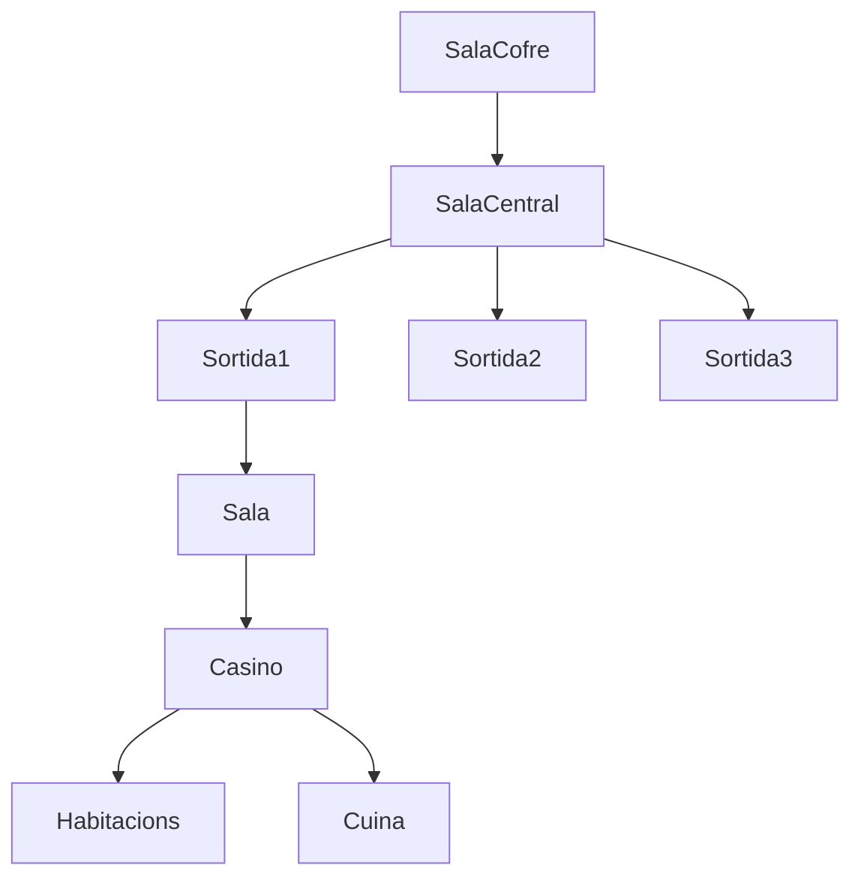

Sala de mazmorra -> cofre al mig -> massa pastosa a la mà

Surten els [[half-elves]], ens acull el [[luren]].

Han passat coses super xungues en el mon. Ciutats envaïdes pels monstres, igual que [[mac-anu]].

La ciutat més propera ([[lia-fail]]) es troba bastant lluny. 

Casino, moltes portes i passadissos, laberíntic.

Dos [[half-elves]] ferits, han atacat monstres. Ens oferim per explorar a canvi d'armes. Volen saber informació.

Ens espera l'endemà a les 6. Estarà cada dia a les 6, si al 3r dia no hi som se'ns donara per perduts.
Nord-est i palante, no hi ha res que no sigui desert en 2 setmanes caminant.

Arribem a l'oasi al cap de 3 hores. Hi ha un rastre que surt i unes formes de la mida d'unes ovelles.

[//begin]: # "Autogenerated link references for markdown compatibility"
[half-elves]: ../monstres/half-elves "half-elves"
[luren]: ../personatges/luren "luren"
[mac-anu]: ../localitats/mac-anu "mac-anu"
[lia-fail]: ../localitats/lia-fail "lia-fail"
[half-elves]: ../monstres/half-elves "half-elves"
[//end]: # "Autogenerated link references"